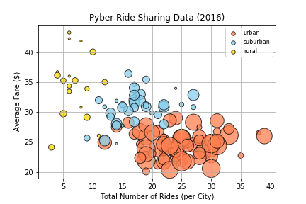
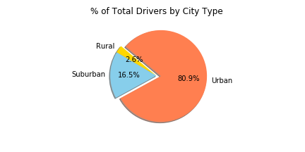
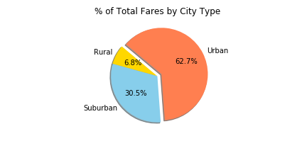

# Ride Sharing Startup 

The purpose of this project is too analysis the company's ride sharing data. The data includes every active driver and historic ride, including details like city, driver count, individual fares, and city type. The analysis was conducted in Jupyter Notebook using Pandas and Motplotlib.

## Analysis and Visualizations

The average fare for rural cities ranges from approximately $25.00 to $50.00 with an average of approximately $35.00 whereas the urban cities range from $20.00 to $30.00 with an average of about $25.00. The suburban cities lie in between the urban and rural averages. In other words, the average fare increases from urban cities to rural cities.

Urban cities are more competitive than suburban and rural areas. Urban areas have 81% of the overall drives but only 68% of the rides.

Rural cities have fewer rides per city (mostly under 10) compared to urban cities which are approximately 25 per city. This is more opportunity and more competition in urban cities than rural cities.

## Bubble chart showing the average fare by number of rides

## Pie chart by drvier type

## Pie chart by city type

## Pie chart by city type

